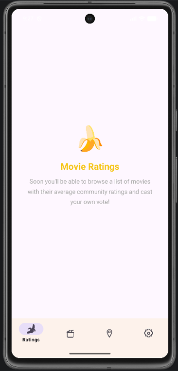
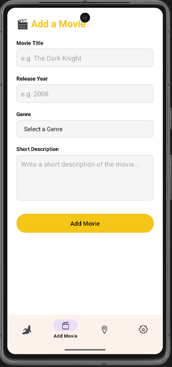
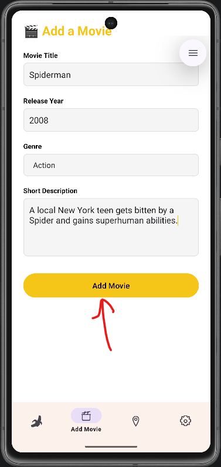
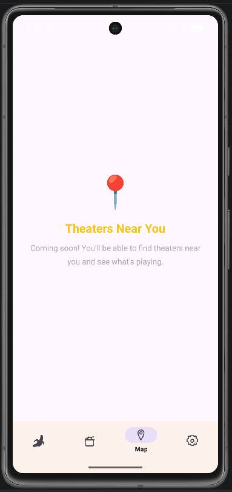
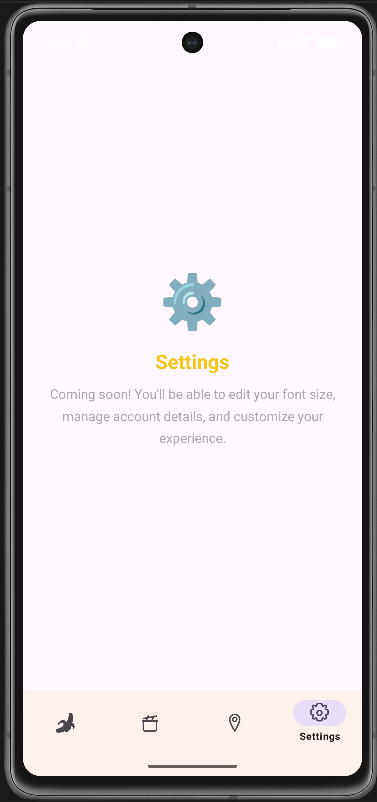

# Rotten Banana

A movie rating Android app built as a school group project.

## About

Rotten Banana lets users add movies and rate them. Inspired by review platforms like Rotten Tomatoes, it was created to practice Android development with Java and fragment-based navigation.

## Features

- **Ratings** — view movie ratings
- **Add Movie** — submit a movie with a title, release year, genre, and description
- **Map** — map view screen
- **Settings** — app settings

## Tech Stack

- **Language:** Java
- **Platform:** Android 
- **UI:** Bottom navigation with Fragments, Material Design
- **Build:** Gradle

## Getting Started

### Prerequisites

- Android Studio
- Android device or emulator running Android 7.0 (API 24) or higher

### Running the App

1. Clone the repository
2. Open the project in Android Studio
3. Let Gradle sync finish
4. Run the app on an emulator or physical device

## Screenshots

 

 

## Group Members

- [Alan Karlo Mangubat](https://github.com/Kmangub)
- [James Swe](https://github.com/BikerSquid619)
- [Kevin Reaves](https://github.com/Reaveskev)
- [Saul Ojeda](https://github.com/saulizar93)

